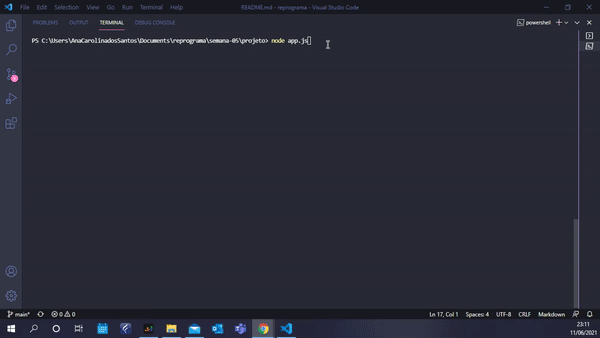

# Semana 05: Projeto Guiado 1 - Desafio ES6

Esquece tudo o que eu falei até o momento. 
Sério! Faz a limpa no cérebro, ignora, abstrai.
ESSA foi a semana mais dificil e mais desafiadora (e olha que só estamos na semana 05)

# O Desafio

Essa semana tivemos que criar um carrinho de compras.
Acho que vou ficar um tempo sem ir ao supermercado (Eu chamo de trauma viu?!).

Foi realmente um desafio este exercicio, por exigir de mim mesma que eu corresse atrás de conhecimentos que não possuia, de maneiras diferentes de pensar minha lógica para desenvolver o projeto. 

Mas enfim, foi um desafio e tanto e aí está meu xodózinho:

